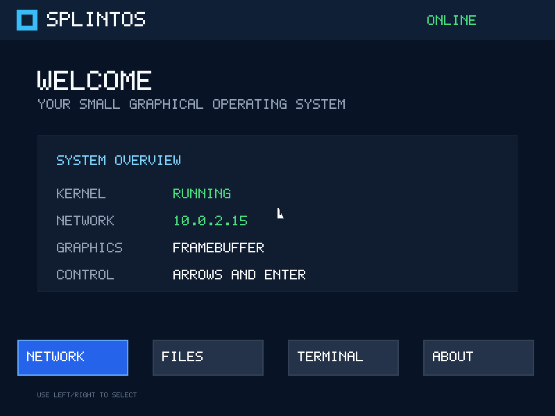
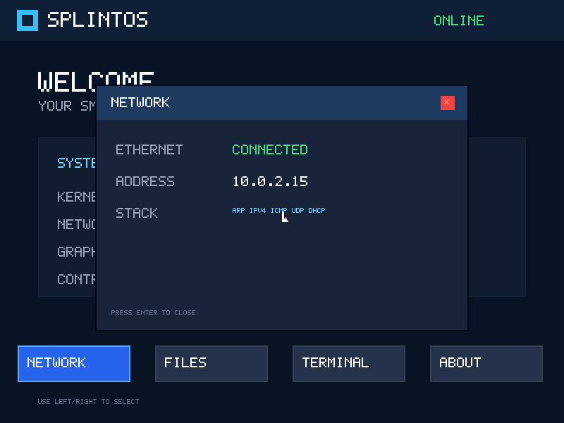
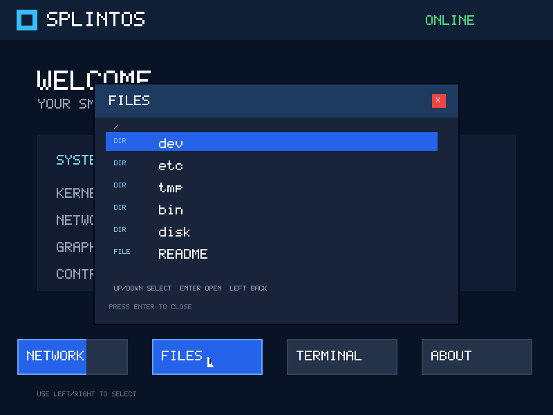
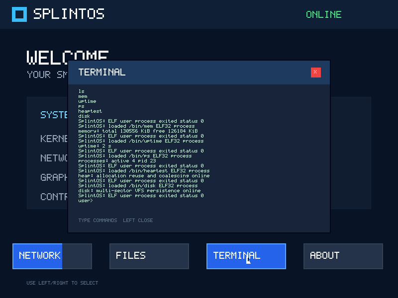
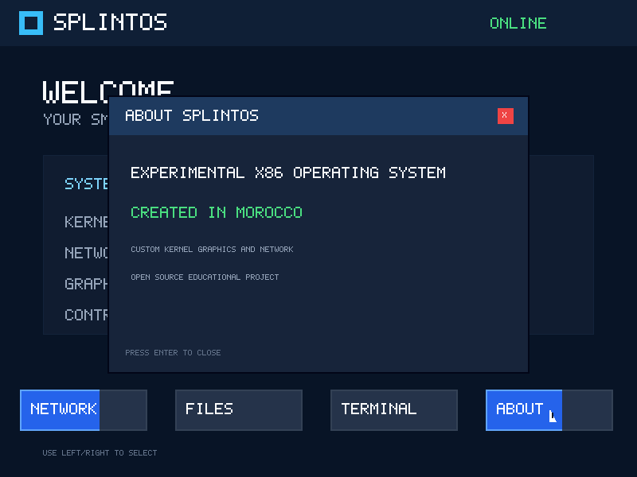

# SplintOS Screenshots

These screenshots were captured directly from the framebuffer of the current
`build/splintos.iso` under QEMU at 800x600.

## Desktop

## Network

## Files

## Terminal

## About

